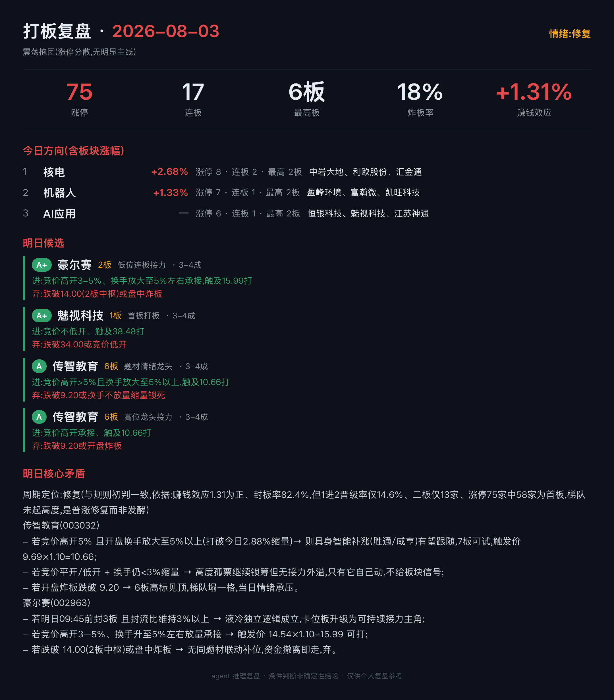
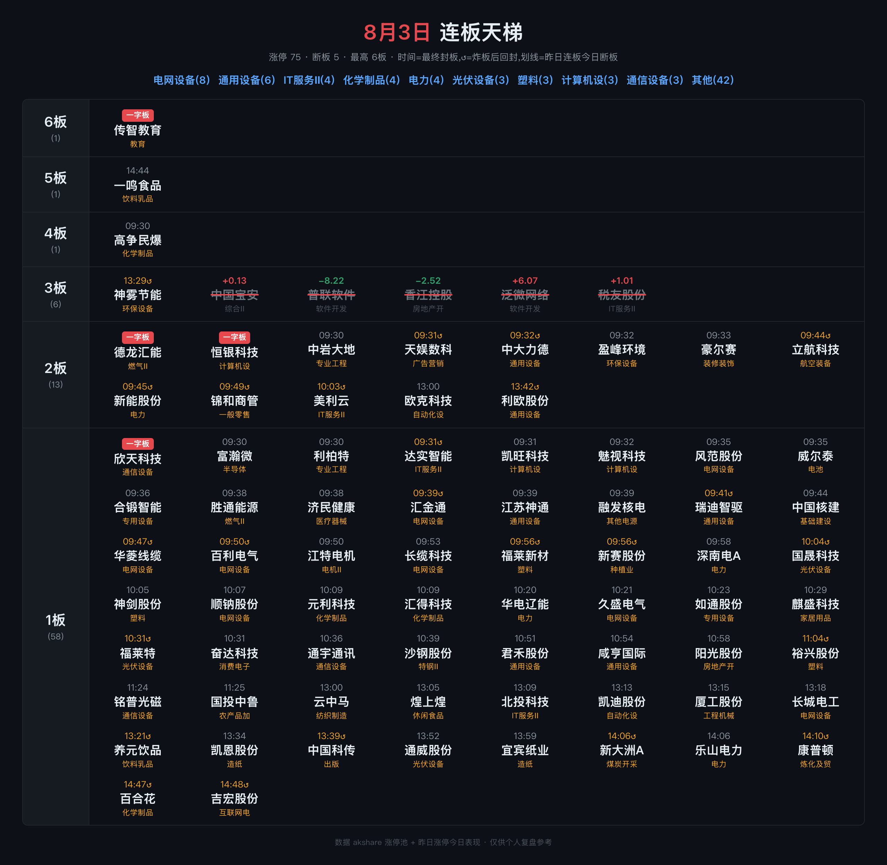

# 打板情绪复盘系统(daban-review)

A股 打板/短线的**情绪面 + 连板属性博弈**复盘与监控系统。不是普通打板软件那种"列连板数+封单量",而是用 Claude agent 做**推理式盘面解析**:识别当日方向、给连板票做多属性归因、推演明日核心矛盾、产出四风格打板候选。

---

## 产出示例

两张图都是系统直接出的图(`?poster=<date>` 海报页 → Playwright 截图),收盘后自动推到飞书。

**每日复盘** —— 情绪 5 指标 + 今日方向(含板块涨幅)+ 明日候选(A+~D 分级与进/弃价位)+ 明日核心矛盾的 if/则 推演:



**连板天梯** —— 按板位分档,标注最终封板时间、一字板、`↺` 炸板后回封;划线为昨日连板今日断板(后跟当日涨跌幅):



> 图中个股仅为系统真实产出的示例,不构成任何投资建议。

---

## 一、定位与核心思想

普通打板工具给的是"截面事实"(谁涨停、几板、封单多少),但打板真正的决策依赖**情绪判断**:

- **连板票是多属性载体**——一只票同时属于多个题材(如 哈药=医药+科技),它的强弱不取决于自己,而取决于"今天代表哪个方向"和"市场今天走哪个属性"。
- **属性之间有对立与联动**——进攻(题材/业绩)vs 防守(避险/低位),一个方向走强常意味着对立方向失去强度。
- **产出是"明日核心矛盾"的条件判断**,而不是评分:形如"若电力续强则它被按,若科技起来它也被按,若自身转强则需辨明双属性发酵哪个"。

本系统把这套方法论固化进 agent 提示词,用结构化数据喂给 Claude,让它按打板选手的思路复盘。

---

## 二、项目结构

```
daban-review/
├── backend/                          # Python 后端
│   ├── daban_review/
│   │   ├── config.py                 # 配置:DB路径 / akshare降频 / Claude中转
│   │   ├── cli.py                    # CLI:review / emotion / ladder / fetch / analyze
│   │   ├── data/                     # 数据层
│   │   │   ├── akshare_client.py     # 涨停池(akshare)+ 分时/日线/指数/人气榜(mootdx),限频重试
│   │   │   ├── store.py              # SQLite(WAL)落库
│   │   │   └── fetch.py              # 拉当日各池 + 中文列名归一 + 落库
│   │   ├── metrics/                  # 指标层(纯本地计算,不限频)
│   │   │   ├── emotion.py            # 情绪温度/晋级率/炸板率/赚钱效应/周期与市场状态初判
│   │   │   ├── ladder.py             # 连板天梯 + 个股画像(封单强度等)
│   │   │   ├── sector.py             # 板块热度聚合(行业 + 题材两维)
│   │   │   ├── auction.py            # 盘前竞价高开抢筹榜
│   │   │   ├── kline.py              # 热门票日K线量价特征(资金审美/量价周期)
│   │   │   └── score.py              # 候选票客观分级(A+~D + 仓位建议),纯规则可回测
│   │   ├── agent/                    # 分析层(claude-agent-sdk)
│   │   │   ├── tools.py              # in-process MCP 工具:情绪/天梯/板块热度/竞价/热门K线
│   │   │   ├── prompt.py             # 方法论系统提示词(灵魂)
│   │   │   └── runner.py             # SDK 执行循环 + 流式回调
│   │   ├── app/                      # 应用层(FastAPI)
│   │   │   ├── service.py            # 报告/情绪/梯队/竞价/分时 + 候选提取分级 + 次日验证回测
│   │   │   └── main.py               # REST + SSE + APScheduler 盘后定时
│   │   └── monitor/                  # 盘中情绪监控(P0 已实现)
│   │       ├── signals.py            # 纯函数判据:龙头炸板 / 炸板潮 / 指数急杀
│   │       ├── watcher.py            # 交易时段轮询循环 + 分频 + 当日去重 + 每轮写库(供前端只读)
│   │       └── notify.py             # 飞书通知:自建应用 SDK 私聊(send_lark)/ webhook 备用
│   ├── tests/                        # pytest 单测(指标 / 打分 / 候选解析)
│   ├── requirements.txt
│   └── .env.example
├── frontend/                         # React + MUI 前端
│   └── src/
│       ├── App.tsx                   # 布局 + 日期选择 + 组装
│       ├── api.ts                    # axios(REST) + fetchEventSource(SSE)
│       ├── theme.ts                  # MUI 暗色交易主题
│       └── components/
│           ├── LiveBar.tsx           # 盘中实时条(20s 轮询 /api/live:数字 + 事件流)
│           ├── EmotionPanel.tsx      # 情绪面板
│           ├── EmotionTrend.tsx      # 情绪周期趋势(ECharts)
│           ├── LadderView.tsx        # 连板天梯(可展开、点击看分时)
│           ├── AuctionPanel.tsx      # 盘前竞价高开抢筹榜
│           ├── ThemePanel.tsx        # 题材热度卡片
│           ├── ReportView.tsx        # 盘面解析(SSE 流式 Markdown)
│           ├── CandidatePanel.tsx    # 四风格候选表(评级/仓位/滚动命中率)
│           ├── ChatDrawer.tsx        # 对话追问(SSE)
│           └── IntradayDialog.tsx    # 个股分时弹窗(原生 ECharts)
├── data/                             # SQLite 库、运行数据(不入库)
└── screenshots/                      # README 用的产出示例图
```

**分层数据流**:
```
data(akshare/mootdx) → metrics(客观骨架) → agent(Claude 推理) → app(REST/SSE) → 前端
                     ↘ monitor(盘中情绪拐点事件 → 飞书通知)
```

---

## 三、技术栈

| 层 | 技术 |
|---|---|
| 后端框架 | Python 3.13、FastAPI、uvicorn、APScheduler |
| LLM | Claude(`claude-agent-sdk`),走自建 Anthropic 兼容网关(Opus),in-process MCP 工具 |
| 数据源 | akshare(涨停池/连板/炸板)、mootdx(pytdx 协议,分时/日线/指数,免费稳定) |
| 存储 | SQLite(WAL 模式) |
| 前端 | React 18 + TypeScript + Vite、MUI v7 + emotion、ECharts、axios、@microsoft/fetch-event-source、react-markdown |
| 通知 | 飞书自建应用 SDK(`lark-oapi`,盘中告警**私聊推送**本人);自定义机器人 webhook 备用 |

---

## 四、功能特色

1. **情绪面板** — 涨停/连板/最高板/炸板率/封板率/赚钱效应/1进2晋级率/高位晋级率,情绪周期(冰点/修复/发酵/高潮/退潮/分歧)与市场状态(震荡抱团 vs 主板强势)规则初判。
2. **连板天梯** — 按板级分档,封单强度(封板资金/流通市值)、炸板标记、悬浮明细;首板可展开全部;**点个股弹分时图**。
3. **板块热度** — 涨停按板块聚合,识别当日资金主攻方向(涨停数/连板数/最高板/龙头)。
4. **盘前竞价高开抢筹榜** — 连板+首板强票的今开/昨收高开幅度排行(竞价定龙头)。
5. **agent 推理式盘面解析** — 方法论驱动:方向拆解、连板票多属性画像、属性对立、明日核心矛盾(if/则)、四风格候选(低位连板/首板/题材龙头/高位接力),**SSE 流式输出**,诚实标注推断不确定性。
6. **四风格候选表 + 客观分级** — agent 在复盘尾部额外输出结构化 JSON 候选,系统提取后按打板量化因子(封流比/首封时间/炸板次数/换手/连板身位 + 情绪周期基准)做 A+~D 分级 + 仓位建议;前端渲染成可排序、点击看分时的候选表。
7. **候选次日验证与滚动命中率** — 候选票隔日自动算开盘/收盘溢价,按评级统计胜率与平均溢价(回测 alpha 的雏形闭环)。
8. **对话追问** — 基于当日数据向 agent 提问(如"小哈今天走哪个属性")。
9. **个股分时弹窗** — 原生 ECharts 价格线 + 昨收参考 + 量柱,炸板下扎一眼可见。
10. **盘后定时自动复盘** — APScheduler 交易日 15:30 自动生成并存库。
11. **盘中情绪拐点监控** — 交易时段轮询涨停池/炸板/人气榜/指数,三类 P0 事件命中即飞书通知:①龙头/高度板(≥4板)炸板 ②炸板潮(实时炸板率破 40%)③指数急杀(上证近15min跌≥0.8%/创业板≥1.2%)。纯规则判据(**不跑 agent**)+ 快照对比 + 当日去重;活跃时段(早盘/尾盘)加密轮询到 30s。watcher 每轮把快照+事件写 SQLite,前端顶部 **LiveBar 实时条**(`/api/live`)可主动看实时涨停/炸板率/最高板/龙头/指数跌幅 + 事件流,watcher 未运行时显示灰条。
12. **AI 调用成本显示** — 每次复盘/持仓分析结束显示本次 token 数与金额(人民币为主 + 美元,按 Opus 4.8 官方单价估算),顶部显示当日累计成本与次数,做成本控制。计价优先用 SDK 的 `total_cost_usd`,经中转网关取不到时按 token × 官方单价自算;单价/汇率集中在 `agent/pricing.py` + `config.usd_cny`。

---

## 五、技术难点与解决

| 难点 | 解决 |
|---|---|
| **akshare 限频严重** | 东财 push2 端点连打即断;涨停池走限频松的 push2ex + 降频重试;实时/分时/指数全改 **mootdx**(通达信公开服务器,免费、不限频、1.3s) |
| **可编程 L2 拿不到** | 通达信 L2 仅客户端可看、无 API,个人拿不到逐笔委托;认清"分时=L1、盘口=L2",第一期只用 L1 盘后数据,分时已足够属性归因 |
| **Claude Agent SDK 接入 + 中转** | 通过 `env` 注入 `ANTHROPIC_BASE_URL/KEY` 走中转网关;用 `@sdk_tool + create_sdk_mcp_server` 把数据封装成 in-process MCP,让 agent 自主调用 |
| **SSE 流式桥接** | FastAPI `StreamingResponse` + `asyncio.Queue`,把 agent 逐段文本推成 SSE 帧;前端 `fetchEventSource` 增量累加 + Markdown 实时渲染 |
| **ECharts 在 MUI Dialog 里只画左边** | `echarts-for-react` 实例复用导致 stale 渲染(单/双 grid、resize、key 均无效);最终改**原生 echarts** 手动 `init/setOption/resize` 解决 |
| **打板方法论量化** | 把"连板多属性/情绪方向对立/明日核心矛盾"这种主观经验拆成可执行的 agent 提示词 + 截面数据判据;候选票再用纯规则因子(封流比/首封/炸板/换手/身位 + 情绪周期)映射成 A+~D 分级,与"次日验证"同口径、可回测 |
| **通达信协议浮点垃圾** | 分钟线偶发 `5.87e-39` 异常量 → 统一清洗(`<1e-6` 归零) |

---

## 六、待办与可拓展

**近期待办:**
- **盘中监控 P1/P2 扩展** — 在已落地的 P0(龙头炸板/炸板潮/指数急杀)之上补:卡位板反包/炸板、竞价变脸(9:25 高开龙头开盘证伪)、首板潮(发酵预警),以及从大盘扩展到热门板块级监控;可选补本地弹窗(osascript)。
- **回测闭环深化** — 当前只算隔日开盘/收盘溢价;补更贴打板口径的验证(是否触发 trigger 价、次日能否一字、分风格胜率曲线)与多日情绪/晋级率序列沉淀。

**中长期可拓展:**
- **概念多属性硬数据** — 接个股概念数据,让"哈药=医药+科技"有数据支撑,而非 agent 知识推断。
- **热门板块盘中监控** — 把企稳监控从大盘扩展到当日热门板块。
- **L2 逐笔(需上券商 QMT)** — 真封/虚封、扫板、撤单的实时盘口博弈信号。

---

## 七、运行方式

**后端**(需 `backend/.env` 配置 `ANTHROPIC_API_KEY/BASE_URL`):
```bash
cd backend
pip install -r requirements.txt
PYTHONPATH=. python -m uvicorn daban_review.app.main:app --port 8000   # API 服务
PYTHONPATH=. python -m daban_review.cli analyze 20260721               # CLI 复盘
PYTHONPATH=. python -m pytest tests/ -v                                # 单测
PYTHONPATH=. python -m daban_review.monitor.watcher                    # 盘中情绪监控(常驻,写库+飞书推送)
PYTHONPATH=. python -m daban_review.monitor.watcher --once             # 监控自检(跑一轮打印+写库)
# 想在前端看盘中实时条:同时起 uvicorn(读库) + watcher(写库)
```

**前端**:
```bash
cd frontend
npm install
npm run dev          # http://localhost:5173
```

**能力边界(诚实)**:数据只到盘后 L1 层级,无 L2 逐笔/撤单;属性归因、方向对立、明日矛盾都是**推断**,基于数据但不保证对——是辅助决策,不是信号机。盘中实时性依赖 mootdx/通达信服务器(交易时段实时)。
